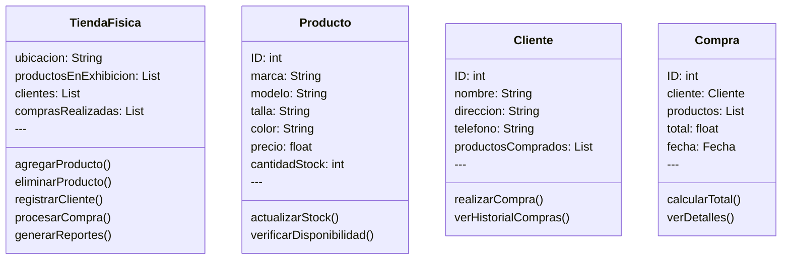

# Reto-2
Repositorio para el Reto 2 del curso de Programación Orientada a Objetos.

```mermaid
classDiagram
    class TiendaFisica {
        ubicacion: String
        productosEnExhibicion: List<Producto>
        clientes: List<Cliente>
        comprasRealizadas: List<Compra>
        ---
        agregarProducto()
        eliminarProducto()
        registrarCliente()
        procesarCompra()
        generarReportes()
    }

    class Producto {
        ID: int
        marca: String
        modelo: String
        talla: String
        color: String
        precio: float
        cantidadStock: int
        ---
        actualizarStock()
        verificarDisponibilidad()
    }

    class Cliente {
        ID: int
        nombre: String
        direccion: String
        telefono: String
        productosComprados: List<Producto>
        ---
        realizarCompra()
        verHistorialCompras()
    }

    class Compra {
        ID: int
        cliente: Cliente
        productos: List<Producto>
        total: float
        fecha: Fecha
        ---
        calcularTotal()
        verDetalles()
    }

```
